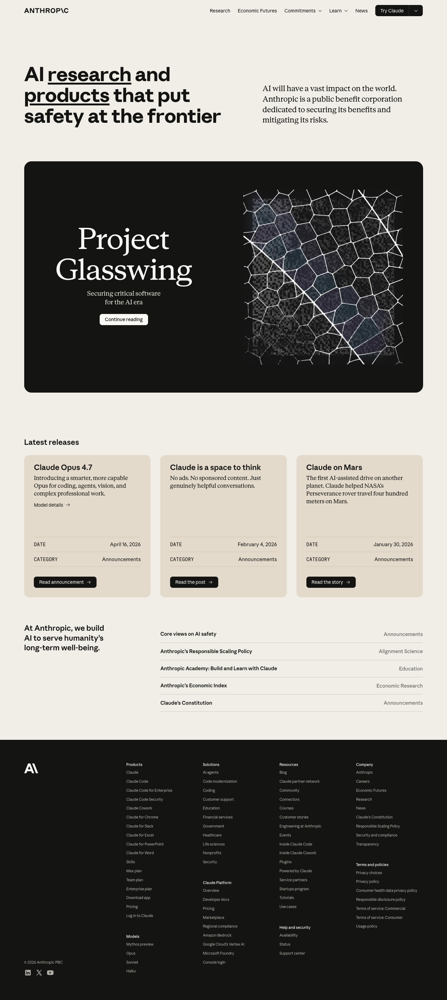
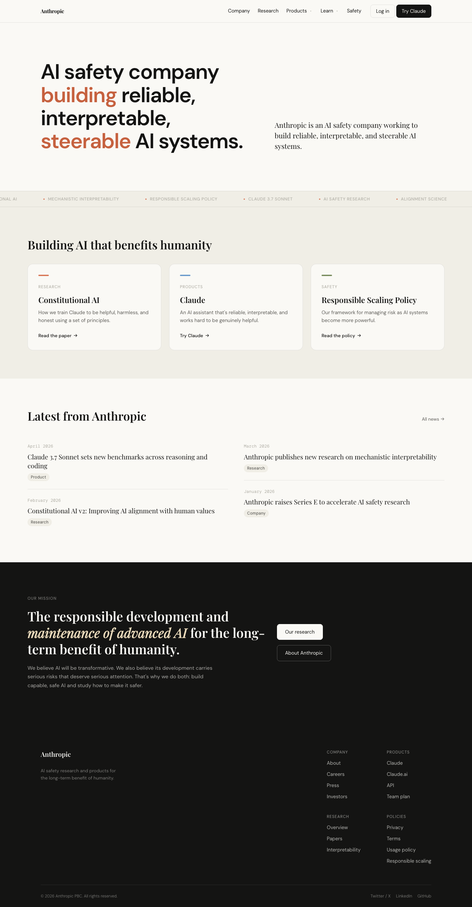

# Design System Extractor

A Chrome extension that reverse-engineers any website's design system in one click — CSS tokens, component structure, computed styles, and keyframe animations — and packages everything into a single markdown file you can feed to an AI to rebuild the UI.

## What it does

Most design cloning tools scrape colors from screenshots. This reads the actual source of truth: CSS custom properties, computed styles, and component HTML. The output is a structured markdown file that captures everything a developer needs to faithfully recreate the design.

**One click. One file. Feed it to Claude or GPT and say "build me something like this."**

## The pipeline

| Layer | What it extracts | Why it matters |
|-------|-----------------|----------------|
| CSS Custom Properties | `:root` variables — the actual design tokens | Modern sites store their entire system in `--color-primary`, `--spacing-lg`, etc. Computed styles miss these. |
| Stylesheet walking | Raw CSS before browser resolution | Gets `rem`, `var()`, `clamp()` originals — not resolved pixels |
| Component HTML | Skeletonized nav, hero, cards, footer | The token colors don't tell you *where* to put them |
| Computed styles | `getComputedStyle()` on real DOM elements | Works on CDN-hosted CSS (Webflow, Framer, etc.) where stylesheet walking fails |
| Keyframe animations | `@keyframes` rules from all sheets | Captures entrance animations, shimmer effects, transitions |

The pipeline runs entirely client-side. No server, no API calls.

## Demo: Anthropic.com

The extension was run on [anthropic.com](https://anthropic.com), producing a single `anthropic-design-system.md` file. That file was passed to an AI with no other context. This is the result:

| Original | Cloned from extracted `.md` |
|----------|--------------------------|
|  |  |

The AI inferred the word-by-word reveal animation from the `.animate-word` class and `opacity/transform` transition values in the extracted styles. The marquee strip came from the `@-webkit-keyframes marquee` rule in the keyframes section. Neither was explicitly described — the data was enough.

## Output format

The extension produces a single merged file named after the site:

```
cloudflare-workers-design-system.md
wisprflow-design-system.md
anthropic-design-system.md
```

Structure:

```markdown
# Site Name Design System
> Extracted from https://site.com

---

## Detected Framework
## Design Tokens (CSS Custom Properties)
### Colors
### Typography Tokens
### Spacing Tokens
### Animation Tokens
## Raw CSS Variables (full dump)

---

## Navigation
## Hero
## CTA Button
## Footer
(skeletonized HTML with [TEXT] and [URL] placeholders)

---

## Navigation Styles
## Hero Styles
## Card Styles
## Footer Styles
## Keyframe Animations
```

## Install

1. Clone this repo
2. Open `chrome://extensions` (or `edge://extensions`)
3. Enable **Developer mode**
4. Click **Load unpacked** and select this folder
5. Navigate to any site, click the extension icon, hit **Extract Design System**

## What it extracts vs what it misses

Works well:
- CSS custom properties (design tokens)
- Typography scales with `clamp()` values preserved
- Spacing systems
- Component HTML structure and class names
- Computed styles via `getComputedStyle()` (catches CDN-hosted CSS)
- `@keyframes` animations
- Framework detection (Tailwind, shadcn/ui, MUI, Bootstrap, Radix, etc.)

Cannot extract:
- Canvas/WebGL animations (runtime-generated, no CSS source)
- Lottie/Rive animations (need the original JSON)
- Proprietary fonts (names are captured, fallbacks suggested)

## Extension prefix filtering

The extractor strips CSS variables injected by browser extensions (Speechify, Grammarly, 1Password, etc.) that would otherwise pollute the output. From 212 raw properties on a Webflow site, you get ~70 clean ones.

## Tech

Manifest V3. No external dependencies. Runs entirely in the browser. Three injected scripts:

- `content-script.js` — samples DOM elements, reads computed styles, collects site signals
- `runStructureScript` — extracts and skeletonizes component HTML
- `runStylesScript` — finds CSS rules for component classes via `getComputedStyle()`

The service worker orchestrates, normalizes, and generates the markdown.

## License

MIT
